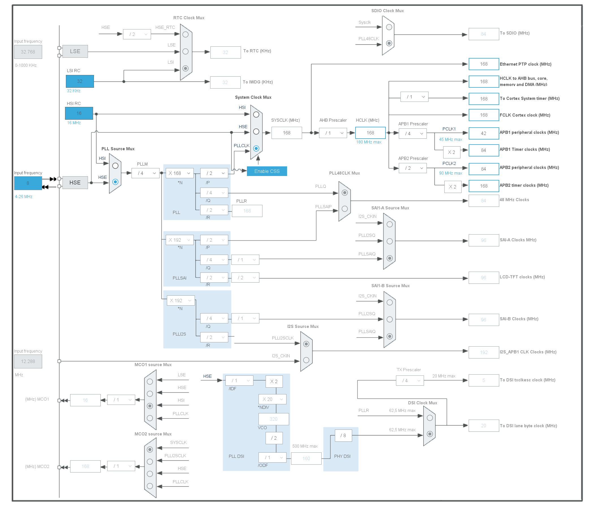

# STM32 Setup
## Clock Setup

## HCLK Max Frequency
HCLK usually set up to 168Mhz, if need to be setting to Max 180Mhz, then need over drive voltage.
``` C
//So 168MHz always be the proper MCU. 180Mhz need over drive.
//Activate the Over-Drive mode 
if (HAL_PWREx_EnableOverDrive() != HAL_OK)
{
  Error_Handler();
}
```
## UART5 Setup
1. USE DMA setup
``` C
// UART5_RX DMA1 Stream0 Peripheral to Memeory
// UART5_TX DMA1 Stream7 Memory to Peripheral
void MX_DMA_Init(void) 
{

  /* DMA controller clock enable */
  __HAL_RCC_DMA1_CLK_ENABLE();

  /* DMA interrupt init */
  /* DMA1_Stream0_IRQn interrupt configuration */
  HAL_NVIC_SetPriority(DMA1_Stream0_IRQn, 0, 0);
  HAL_NVIC_EnableIRQ(DMA1_Stream0_IRQn);
  /* DMA1_Stream7_IRQn interrupt configuration */
  HAL_NVIC_SetPriority(DMA1_Stream7_IRQn, 0, 0);
  HAL_NVIC_EnableIRQ(DMA1_Stream7_IRQn);

}
```
# USBD Setup
## USBD Init
``` C
if (USBD_Init(&hUsbDeviceHS, &HS_Desc, DEVICE_HS) != USBD_OK)
{
  //...
}
/**
* @brief  USBD_Init
*         Initializes the device stack and load the class driver
* @param  pdev: device instance
* @param  pdesc: Descriptor structure address
* @param  id: Low level core index
* @retval None
*/
USBD_StatusTypeDef USBD_Init(USBD_HandleTypeDef *pdev,
                             USBD_DescriptorsTypeDef *pdesc, uint8_t id)

```
1. hUsbDeviceHS 
This variable is defined in usb_device.c file, which is customized.
```C
/* USB Device handle structure */
typedef struct _USBD_HandleTypeDef
{
  uint8_t                 id;
  uint32_t                dev_config;
  uint32_t                dev_default_config;
  uint32_t                dev_config_status;
  USBD_SpeedTypeDef       dev_speed;
  USBD_EndpointTypeDef    ep_in[16];
  USBD_EndpointTypeDef    ep_out[16];
  uint32_t                ep0_state;
  uint32_t                ep0_data_len;
  uint8_t                 dev_state;
  uint8_t                 dev_old_state;
  uint8_t                 dev_address;
  uint8_t                 dev_connection_status;
  uint8_t                 dev_test_mode;
  uint32_t                dev_remote_wakeup;
  uint8_t                 ConfIdx;

  USBD_SetupReqTypedef    request;
  USBD_DescriptorsTypeDef *pDesc;
  USBD_ClassTypeDef       *pClass;
  void                    *pClassData;
  void                    *pUserData;
  void                    *pData;
  void                    *pBosDesc;
  void                    *pConfDesc;
} USBD_HandleTypeDef;
```

2. HS_Desc 
This variable is defined in usbd_desc.c file , which is customized.
```C
USBD_DescriptorsTypeDef HS_Desc =
{
  USBD_HS_DeviceDescriptor
, USBD_HS_LangIDStrDescriptor
, USBD_HS_ManufacturerStrDescriptor
, USBD_HS_ProductStrDescriptor
, USBD_HS_SerialStrDescriptor
, USBD_HS_ConfigStrDescriptor
, USBD_HS_InterfaceStrDescriptor
#if (USBD_LPM_ENABLED == 1)
, USBD_HS_USR_BOSDescriptor
#endif /* (USBD_LPM_ENABLED == 1) */
};
```
3. USBD_LL_Init
This funtion is from usbd_conf.c, which is also customized.
```C
/**
  * @brief  Initializes the low level portion of the device driver.
  * @param  pdev: Device handle
  * @retval USBD status
  */
USBD_StatusTypeDef USBD_LL_Init(USBD_HandleTypeDef *pdev)
```
The function parameters is hUsbDeviceHS.

next step is in this file , use a dedicated global variable define
```C
PCD_HandleTypeDef hpcd_USB_OTG_HS;
```
```C
/* Init USB Ip. */
  if (pdev->id == DEVICE_HS) {
  /* Link the driver to the stack. */
  hpcd_USB_OTG_HS.pData = pdev;
```
hpcd_USB_OTG_HS is the LL variable, a struct contains ep, addrss, and others ll staus.
then use the pData to link upper top level varaible by pointers.

For the 
```C
PCD_TypeDef             *Instance;   /*!< Register base address             */
PCD_InitTypeDef         Init;        /*!< PCD required parameters           */
```
And the Init variable point to
```C
typedef USB_OTG_CfgTypeDef     PCD_InitTypeDef;

/**
  * @brief  USB Instance Initialization Structure definition
  */
typedef struct
{
  uint32_t dev_endpoints;           /*!< Device Endpoints number.
                                         This parameter depends on the used USB core.
                                         This parameter must be a number between Min_Data = 1 and Max_Data = 15 */

  uint32_t Host_channels;           /*!< Host Channels number.
                                         This parameter Depends on the used USB core.
                                         This parameter must be a number between Min_Data = 1 and Max_Data = 15 */

  uint32_t speed;                   /*!< USB Core speed.
                                         This parameter can be any value of @ref USB_Core_Speed                 */

  uint32_t dma_enable;              /*!< Enable or disable of the USB embedded DMA used only for OTG HS.        */

  uint32_t ep0_mps;                 /*!< Set the Endpoint 0 Max Packet size.                                    */

  uint32_t phy_itface;              /*!< Select the used PHY interface.
                                         This parameter can be any value of @ref USB_Core_PHY                   */

  uint32_t Sof_enable;              /*!< Enable or disable the output of the SOF signal.                        */

  uint32_t low_power_enable;        /*!< Enable or disable the low power mode.                                  */

  uint32_t lpm_enable;              /*!< Enable or disable Link Power Management.                               */

  uint32_t battery_charging_enable; /*!< Enable or disable Battery charging.                                    */

  uint32_t vbus_sensing_enable;     /*!< Enable or disable the VBUS Sensing feature.                            */

  uint32_t use_dedicated_ep1;       /*!< Enable or disable the use of the dedicated EP1 interrupt.              */

  uint32_t use_external_vbus;       /*!< Enable or disable the use of the external VBUS.                        */

} USB_OTG_CfgTypeDef;
```

4. Call Flow Diagram
[!USB Initialize Diagram](./usb/USB_Device_initialization_main_functions_call_graph.png)


# STM32 USB Interrtup
## Entry of the USB Interrupt
Default usb interrupt is 
```C
/**
  * @brief This function handles USB On The Go HS global interrupt.
  */
void OTG_HS_IRQHandler(void)
{
  /* USER CODE BEGIN OTG_HS_IRQn 0 */
  //Debug_Print("OTG_HS_IRQHandler.\n");
  /* USER CODE END OTG_HS_IRQn 0 */
  usb_int_counter++;
  HAL_PCD_IRQHandler(&hpcd_USB_OTG_HS);
  /* USER CODE BEGIN OTG_HS_IRQn 1 */

  /* USER CODE END OTG_HS_IRQn 1 */
}
```
All the interrupt including setup, and normal transceiver packet parse will be done
in this function.
